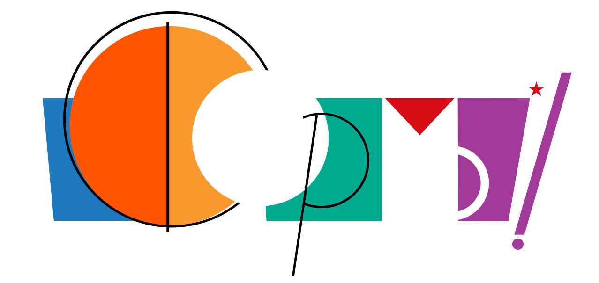
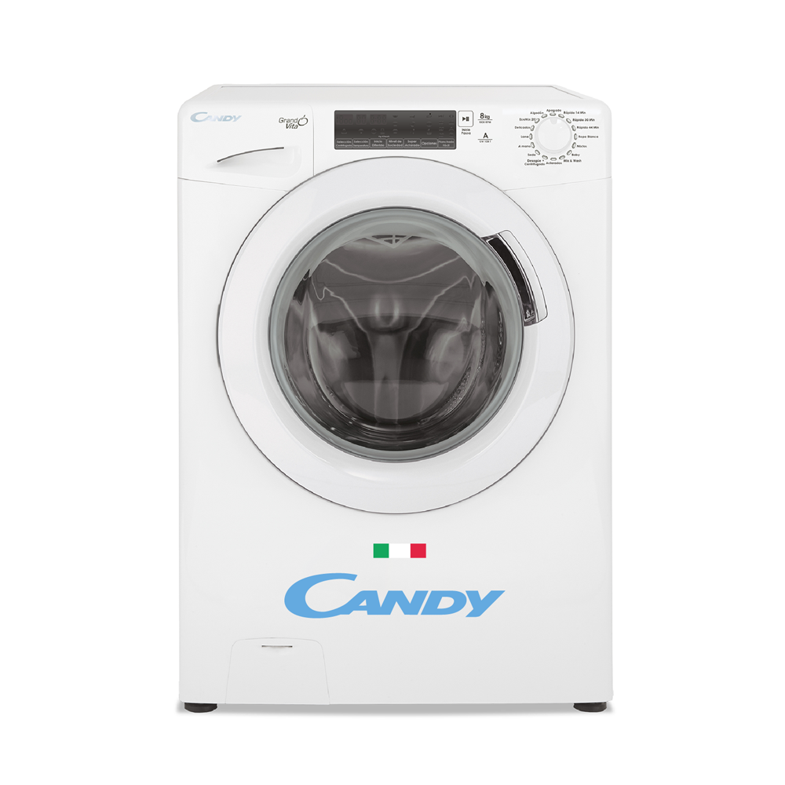
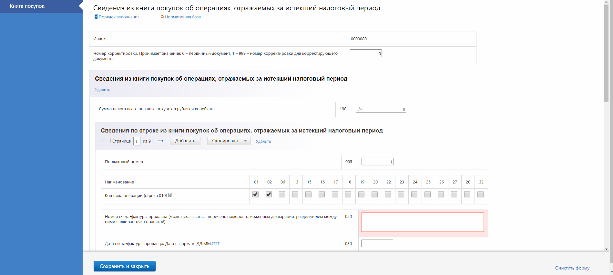
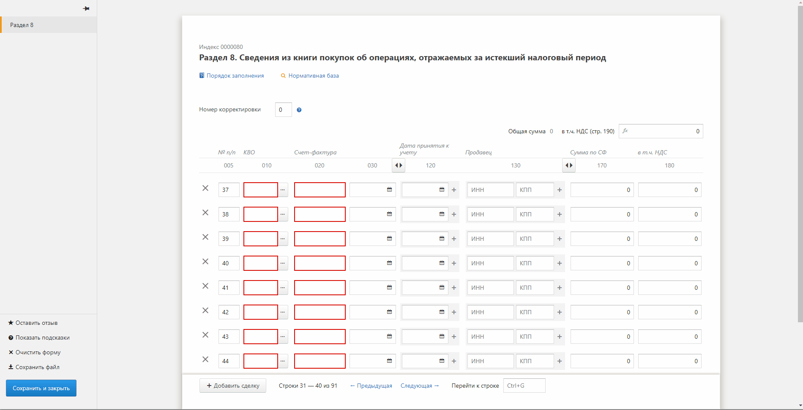

Note: Всем привет. Наверно все уже догадались чем занимается наша команда, если кто не смог прочитать, то тут написано "Формы" и как бы странно это не звучало, но команда "Формы" делает формы, и я пожалуй мог бы закончить свой рассказ на этом замечательном моменте, но тогда вы бы не узнали как нам удается выпускать по **TODO** N **TODO** форм каждый месяц и успевать решать сложные и интересные задачки.

---

## Пользователи Форм

- KeWeb
- Отчет.ру
- КЭМБ
- Бухгалтерия
- РПН
- КОПФ
- Документооборот
- Метрика
- Декларант

NOTE: Мы являемся частью Экстерна, но в отличии от KeWeb'а мы сервисная команда, развивающая различные сервисы, которыми пользуются не только в Экстерне, но и в других командах контура.

---

## Команда Форм

- 40 человек<!-- .element: class="fragment" data-fragment-index="1" -->
- 6 подкоманд<!-- .element: class="fragment" data-fragment-index="2" -->
- 8? сервисов<!-- .element: class="fragment" data-fragment-index="3" -->

NOTE: Наша команда достаточно многочисленная. На текущий момент нас 40 человек. Которые в свою очередь разделены по 6 подкомандам со своими зонами ответствености, развивающие 8? сервисов.

---

## Сервисы Форм

- **Forms.Api** – Единое API для работы с формами
- **Flash.Props** – Сбор свойств, механика проверок
- **Forms.Classification** – Резолвинг xml, инфа по формам
- **Fsprinter** – Печать форм в PDF
- **CrossChecker** – Проверки (доверености и др.)
- **Picklist** – Сервис справочников
- **Highlander** и **Candy** – Редакторы форм

NOTE: Все сервисы, которые мы развиваем преследуют единую цель. А именно, предоставление удобного и простого инструмента для загрузки файлов форм, сбора свойств, проведения авторасчетов и валидация, печать и редактирование. Вот про редакторы я остановлюсь более подробно, так как это единственная часть имеющая фронтендную часть.

---

## Редакторы форм

<!-- .element: class="fragment fade-right" data-fragment-index="1" style="width: 60%; float: left;" -->

<!-- .element: class="fragment fade-left" data-fragment-index="2" style="width: 40%; float: left;" -->

Note: У нас существует два редактора: Highlander и Candy. Каждый из них имеет свои достоинства и недостатки, о которых я сейчас расскажу.

---

## Highlander

NOTE: На данный момент основной редактор форм, позволяющий создавать достаточно сложные формы с авторасчетами включающими в себя фильтры и группировку. Имеет отлаженный процесс по созданию и множество уже реализованных форм. Но как можно увидеть, основным недостатком форм является очень недружелюбный интерфейс для пользователей. Именно по этой причине на его замену активно развивается другой редактор, Candy.

---

## Candy

NOTE: А вот та же форма что и на прошлом слайде, но реализованая в новом-модном-молодежном редакторе Candy. Как можно заметить форма кардинально отличается. При реализации форм мы старемся учитывать общеконтуровские гайды и используем компоненты react-ui.

---

## Встроенный протокол

NOTE: Ещё одной крутой фичей, разработка которой была закончена буквально пару недель назад и находится в процессе релиза является встраивание протокола контроля на страницу редактора. Это позволяет пользователю получить информацию об ошибках в форме не покидая редактор и возможность исправить их.

---

## Технологии

- React
- Redux
- Flow

NOTE: По технологиям у нас всё достаточно стандартно, разве кроме того что являясь частью экстерна мы используем Flow вместо TypeScript. Активно внедряем использование Redux, а ещё мы используем кодогенерацию о которой вы можете узнать и попробовать себя в интересных задачах.

---

### Планы и ярмарка вакансий

**TODO**: Планы на ближайшее будущее и ярмарка вакансий (пердрасчеты на бекенде, большой объем, конструктор форм)