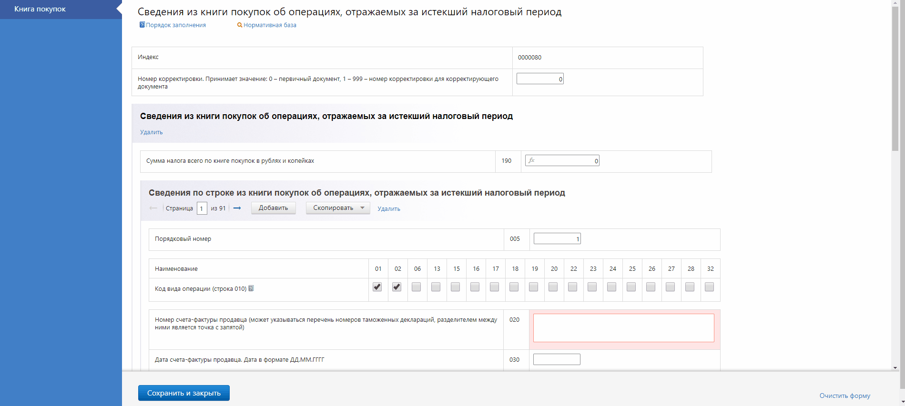

Note: Всем привет. Наверно все уже догадались чем занимается наша команда, если кто не смог прочитать, то тут написано "Формы" и как бы странно это не звучало, но команда "Формы" делает формы, и я пожалуй мог бы закончить свой рассказ на этом замечательном моменте, но регламент требует рассказать несколько более подробно.

---

## Пользователи Форм

- KeWeb
- Отчет.ру
- КЭМБ
- Бухгалтерия
- РПН
- КОПФ
- Документооборот
- Метрика
- Декларант
- Диадок *(на подходе)*<!-- .element: style="color: #808080; font-size: 70%;" -->

NOTE: Мы являемся частью Экстерна, но в отличии от того же KeWeb'а мы сервисная команда, развивающая различные сервисы работы с формами, которыми пользуются не только в Экстерне, но и в других командах контура.

---

## Команда Форм

- 40 человек<!-- .element: class="fragment" data-fragment-index="1" -->
- 6 подкоманд<!-- .element: class="fragment" data-fragment-index="2" -->
- 12 сервисов<!-- .element: class="fragment" data-fragment-index="3" -->
- 16 тестовых площадок<!-- .element: class="fragment" data-fragment-index="4" -->
- 556 форм (220 в 2017 году)<!-- .element: class="fragment" data-fragment-index="5" -->

NOTE: Наша команда достаточно многочисленная. На текущий момент нас 40 человек. Которые в свою очередь разделены на 6 подкоманд со своими зонами ответствености. И все вместе мы развиваем и поддерживаем 12 различных сервисов. Используя 16 тестовых площадок. Выпущено порядка 556 форм, из них 220 было выпущено/обновлено в 2017. Териториально мы располагаемся на 9-м этаже в 914 комнате напротив KeWeb'а.

---

## Сервисы Форм

- **Forms.Api** – Единое API для работы с формами
- **Flash.Props** – Сбор свойств
- **Forms.Classification** – Резолвинг xml, инфа по формам
- **Fsprinter** – Печать форм в PDF (HTML)
- **CrossChecker** – Кросс-проверки
- **Picklist** – Сервис справочников
- **Highlander** и **Candy** – Редакторы форм

NOTE: Все сервисы, которые мы развиваем преследуют единую цель. А именно, предоставление удобного и простого инструмента для загрузки файлов форм, сбора свойств, проведения авторасчетов и валидаций, печать и редактирование. На самом дело разграничение сервисов и их функциональность несколько сложнее чем описано тут. Например для внешнего потребителя тот же flash.props является частью forms.api, а Highlander это далеко не просто редактор. Но это всё детали. Вот на чем я действительно остановлюсь более подробно так это редакторы, так как именно эта часть имеет визуальную составляющую, а всё остальное это скучный шарповый бекенд.

---

## Редакторы форм

<!-- .element: class="fragment fade-right" data-fragment-index="1" style="width: 60%; float: left;" -->

<!-- .element: class="fragment fade-left" data-fragment-index="2" style="width: 40%; float: left;" -->

Note: У нас существует два редактора: Highlander и Candy. Каждый из них имеет свои достоинства и недостатки, о которых я сейчас расскажу.

---

## Highlander

NOTE: На данный момент основной редактор форм, позволяющий создавать достаточно сложные формы с авторасчетами включающими в себя фильтры и группировку. Имеет отлаженный процесс по созданию и множество уже реализованных форм. Но как можно увидеть, основным недостатком Highlander является его очень недружелюбный интерфейс для пользователей. Именно по этой причине на его замену активно развивается другой редактор, Candy.

---

## Candy

NOTE: А вот та же форма что и на прошлом слайде, но реализованая в новом-модном-молодежном редакторе Candy. Как можно заметить форма кардинально отличается. При реализации форм мы старемся учитывать общеконтуровские гайды и используем компоненты react-ui.

---

## Встроенный протокол

NOTE: Одна из крутых фич, которая была выпущена не так давно является встраивание протокола контроля на страницу редактора. Это позволяет пользователю получить информацию об ошибках в форме не покидая редактор и возможность исправить их. Кстати хотелось бы отметить за основной вклад в реализацию этой фичи и поблагодарить нашего уже бывшего стажера "Кирилла Протасова".

---

## Технологии

- React, Redux
- Flow, Eslint, Stylelint
- Mocha, Chai, Sinon, Enzyme, Storybook
- Babel, Acorn, Webpack

NOTE: По технологиям у нас всё достаточно стандартно. React-Redux. Для проверка кода используем Flow, Eslint и Stylelint. Для юнит тестирования используем Mocha+Chai+Sinon, Enzyme и Storybook для react компонентов. В функциональных тестах используем самописную утилитку совместно с Mocha. При сборке форм активно применяем кодогенерацию с помощью Babel и далее собираем всё Webpack'ом. Более подробно о процессе создания форм я расскажу на одной из следующих летучек.

---

### Планы и ярмарка возможностей

- Редактирование больших объемов данных
- Конструктор форм для Candy
- Новая механика авторасчетов
- Сбор пользовательских метрик

---

## Спасибо

https://wkich.github.io/candy/slides/ - презентация